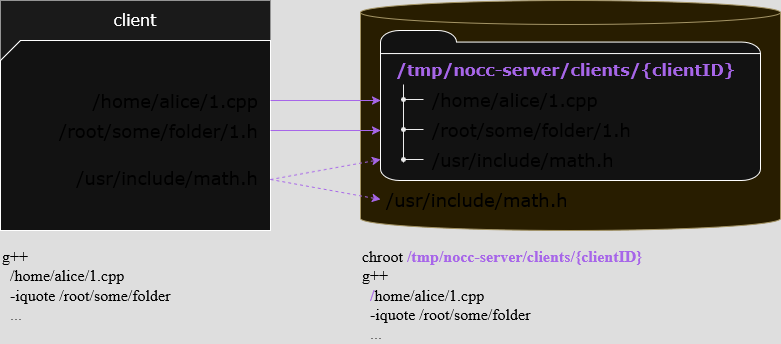

# nocc architecture

Here we describe some aspects of `nocc` internals.

<p><br></p>

## Daemon, client, and server

<p align="center">
    
</p>

`nocc` itself is a lightweight binary that pipes command-line to `nocc-daemon`.

When a build system (make / ninja / etc.) simultaneously calls compilation jobs like
```bash
nocc g++ ... 1.cpp
nocc g++ ... 2.cpp
# other 100k jobs
```
then this binary is executed, actually. All its sources are present in [a single file](../cmd/nocc/main.go). 
`nocc` processes start and die, while a daemon is running.

`nocc-daemon` is a background process written in Go. 
It's started by the very first `nocc` invocation and dies in 15 seconds after the last `nocc` process dies (it's an assumption *"a build has finished"*).
The daemon keeps all connections with grpc streams and stores an includes cache in memory. 

When a new `nocc` process starts and pipes a command-line to the daemon, the daemon parses it. Parsing could result in:
* *(typical case)* invoked for compiling .cpp to .o
* invoked for compiling a precompiled header
* invoked for linking
* a command-line has unsupported options
* a command-line could not be parsed (an input file not detected, etc.)
* remote compilation is not available (e.g. `-march=native`)

Compiling a cpp file is called **an invocation** (see [invocation.go](../internal/client/invocation.go)). 
Every invocation has an autoincrement *sessionID* and is compiled remotely. 
Precompiled headers are handled in a special way (see below).
All other cases fall back to local compilation.

`nocc-server` is a background process running on every compilation node. 
It handles compilation and stores caches. 

When `nocc-daemon` starts, it connects to all servers enumerated in the `Servers` property
For a server, a launched daemon is **a client**, with a unique *clientID* 
([see](./configuration.md#configuring-nocc-daemon)). 

Here's the order: a build process starts → a daemon starts → a new client appears an all servers → the client uploads files and command-lines → the server compiles them and sends objs back → `nocc` processes start and die, whereas `nocc-daemon` stays in the background → a build process finishes → a daemon dies → the client disappears on all servers.


<p><br></p>

## Balancing files over servers

When a daemon has an invocation to compile `1.cpp`, it **chooses a remote server based on file name hash**.
It does not try to balance servers by load, or least used, etc. — just a name hash.

The intention is simple: when a build process runs from different machines, it could be in different folders in CI build agents — we want a file with its dependencies to point to one and the same server always.
Even if file contents have changed since the previous run, probably its dependencies remain more or less the same and thus have already been uploaded to that exact server.

If a remote server is unavailable, a daemon does not try to compile this file on another server: it switches to local compilation. 
The "unavailable" state should be detected and fixed by some external monitoring, we don't want to pollute caches on other servers at this time.


<p><br></p>

## Algorithm and protocol

<p align="center">
    
</p>

Here's what a cpp compilation (one `nocc` invocation handled by a daemon) looks like:
* For an input cpp file, find all dependent h/hxx/inc/pch/etc. that are required for compilation.
* Send sha256 of the cpp and all dependencies to the remote. The remote returns indexes that are missing.
* Send all files needed to be uploaded. If all files exist in the remote cache, this step is skipped.
* After the remote receives all required files, it starts compiling obj (or immediately takes it from obj cache).
* When an obj file is ready, the remote pushes it via grpc stream. On a compilation, just *exitCode/stdout/stderr* are sent.
* The daemon saves the .o file, and the `nocc` process dies.


<p><br></p>

## Client file structure mappings

Every running daemon is supposed to have a unique *clientID*. 
All files uploaded from that daemon are saved into a working dir representing a client's file structure. 
The target idea for `nocc-server` is to launch `g++` in a chroot, with *clientID* as base:

<p align="center">
    
</p>

When a cpp depends on system headers (`<iostream>` and others), they are also checked recursively, 
but a server responds to upload only files that are missing or different. 

While a daemon is running, that directory on a server is populated with files required for compilation 
(either uploaded or hard-linked from src cache, see below). 
When a daemon dies (a client disconnects), the server directory is totally cleared.

Note, that a client working dir *does not contain all files* from a client: only files uploaded to the current shard.
Having 3 servers, a client balances between them based on a cpp basename.


<p><br></p>

## Src cache

**If a file was uploaded once, it isn't required to be uploaded again** — it's the idea behind src cache.

Src cache is based on file hashes (SHA256), not on file names.
It stores source files: cpp, h, hxx, inc, etc.
Files `1.cpp` and `2.cpp` are considered the same if they have equal hashes.

"Restoring from cache" is just a hard link from a storage to a destination path. 
For example, if `1.cpp` and `1.h` were already uploaded:

<p align="center">
    
</p>

If `1.cpp` was uploaded, then modified, then its hash would change, and it would be requested to be uploaded again. BTW, after reverting, no uploads will be required, since a previous copy would already exist unless removed.

There is an LRU replacement policy to ensure that a cache folder fits the desired size,
see [configuring nocc-server](./configuration.md#configuring-nocc-server).

All caches are cleared on server restart.


<p><br></p>

## Obj cache

**If a file was compiled once, it isn't required to be compiled again** — it's the idea behind obj cache.

This is especially useful to share obj files across build agents: if one build agent compiles the master branch, other build agents can reuse a ready obj for every cpp.

The hardest problem is how to detect that *"this .cpp was already compiled, we can use .o"*. 
It's also based on hashes.

The final server cmd line looks like
```bash
g++ -Wall -c ... -iquote headers -o some.cpp.o some.cpp
```

We want to reuse a ready obj file if and only if:
* the cpp file is the same (its name and sha256)
* all dependent h/inc/pch/etc. are the same (their count, order, size, sha256)
* all C++ compiler options are the same (except include paths)

<p align="center">
    
</p>

If a project is being compiled with different compiler options (for example, with and without debug symbols), then every cpp would have two objects stored in obj cached, and recompilation would choose one of them based on the current invocation.

Like src cache, obj cache also has an LRU expiration. Obj cache is also dropped on restart.


<p><br></p>

## Own precompiled headers

`nocc` provides a custom solution when it comes to precompiled headers. When invoked like
```bash
nocc g++ -x c++-header -o all-headers.h.gch all-headers.h
```
It emits `all-headers.h.nocc-pch` and `all-headers.h.gch` (in case remote compilation fails) on the client-side. Later when the precompiled header is requested, it is compiled on the server-side into a real `.gch/.pch`.

<p align="center">
    
</p>

There is one notable reason of doing it this way:
- A precompiled header can get very big, so the first run uploading it to N servers simultaneously takes too long, longer that compiling the precompiled header on N servers

A `.nocc-pch` file is a json file containing the following information.
- The hash of the locally compiled pch file (for server-side usage of key for obj cache)
- The Compiler name
- The input/output name
- The Compiler arguments

When a client collects dependencies and sees `#include "all-headers.h"`, it discovers `all-headers.h.nocc-pch`.
It then sends an extra option to the server telling that a pch file should be compiled.

When `all-headers.h.nocc-pch` is uploaded, the remote runs the commandline from deserializing the `nocc-pch` file resulting in `all-headers.h.gch`, but stored on remote (until restart).
After it has been uploaded and compiled once, all other cpp files depending on this `.nocc-pch`
will use already compiled `.gch` that is hard-linked into a client working dir.

If remote compilation fails for any reason, `nocc` will fall back to local compilation, using the pch the locally generated pch.


<p><br></p>

## CMake depfiles

CMake (sometimes with `make`, often with `ninja`) invokes the C++ compiler like
```bash
nocc g++ -MD -MT example.dir/1.cpp.o -MF example.dir/1.cpp.o.d -o example.dir/1.cpp.o -c 1.cpp
```

The [flags](https://gcc.gnu.org/onlinedocs/gcc/Preprocessor-Options.html) 
`-MD` and others mean: along with an object file `1.cpp.o`, generate a dependency file `1.cpp.o.d`.
A dependency file is a text file with all dependent includes found at any depth.
Probably, it's used by CMake to track the recompilation tree on that files change.

`nocc` detects options like `-MD` and emits a depfile on a client-side, after having collected all includes.
Moreover, these options are stripped off and are not sent to the remote at all.

The following options are supported: `-MF {file}`, `-MT {target}`, `-MQ {target}`, `-MD`.  
Others (`-M`/`-MMD`/etc.) are unsupported. When they occur, `nocc` falls back to local compilation.


<p><br></p>

## Local fallback queue

When some remotes are not available, files that were calculated to be compiled on that remotes,
fall back to local compilation.

"Local compilation" is just executing the specified command-line in a separate process.
Note, that local compilation is performed within a daemon instead of passing it to a `nocc` wrapper.
This is done in order to maintain a single queue:
it makes a huge bunch of `nocc` invocations to be throttled to a limited number of local C++ processes.

The local compilation is also launched when a command-line is unsupported or could not be parsed.

